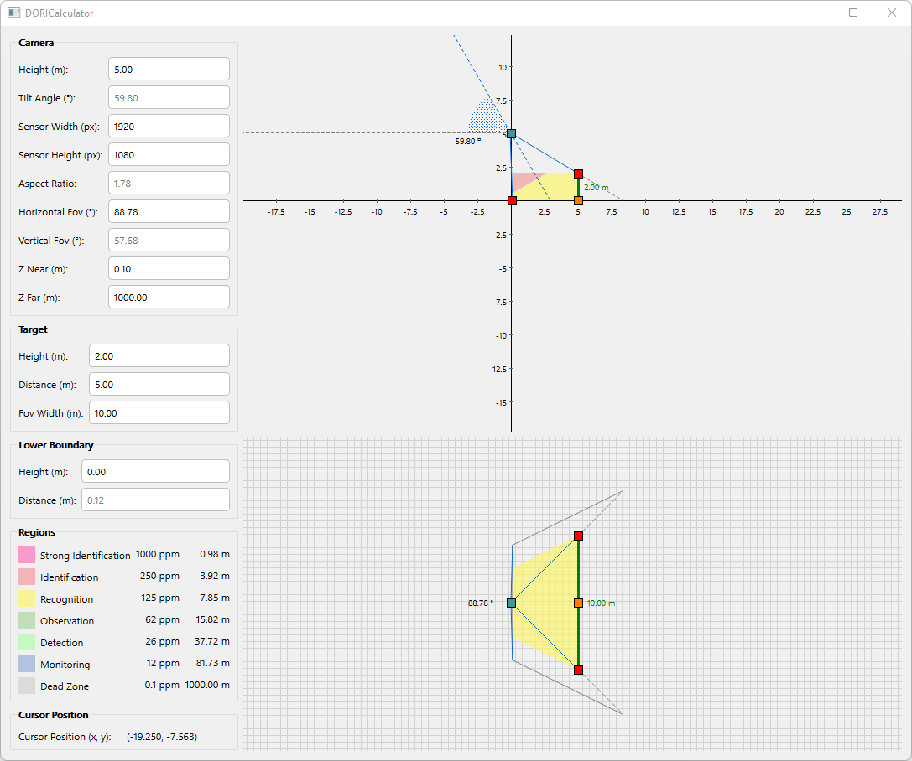

# DORI Calculator
DORI (Detection - Observation - Recognition - Identification) limit calculator based on IEC EN62676-4: 2015 International Standard.

## Screenshots

## Keywords
C++, Qt 5.15.2, Eigen, OpenGL, GLSL, JSVG
